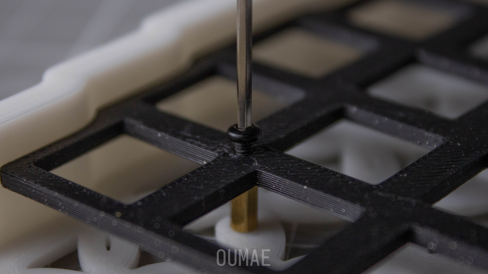
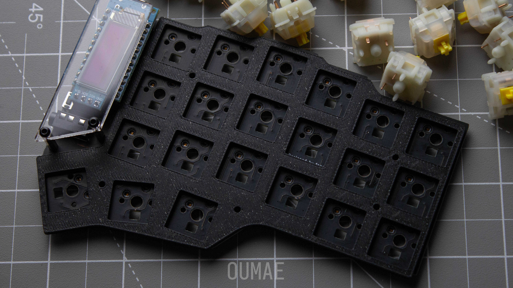
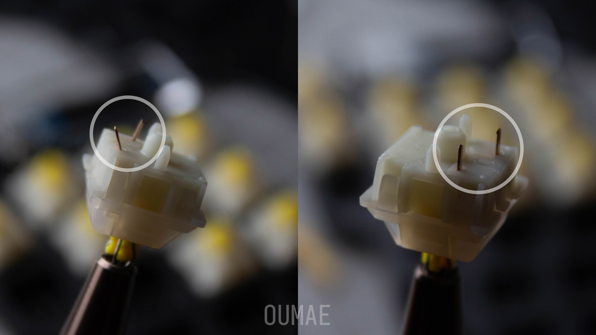
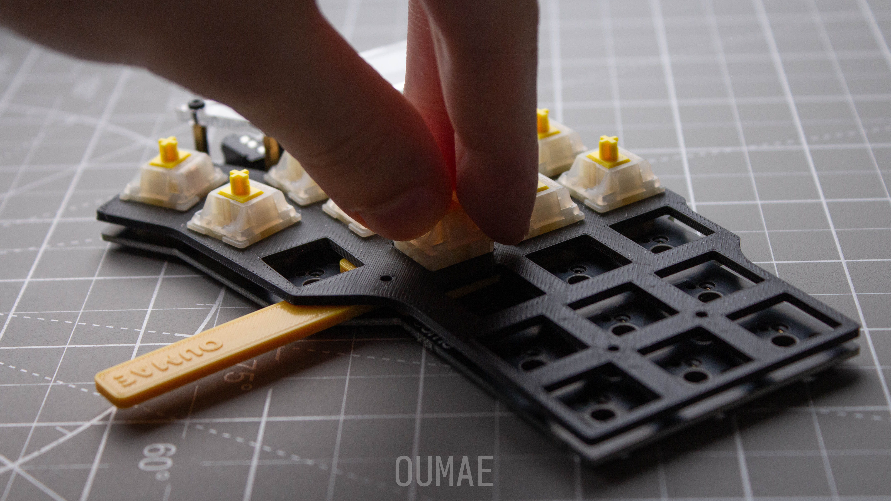
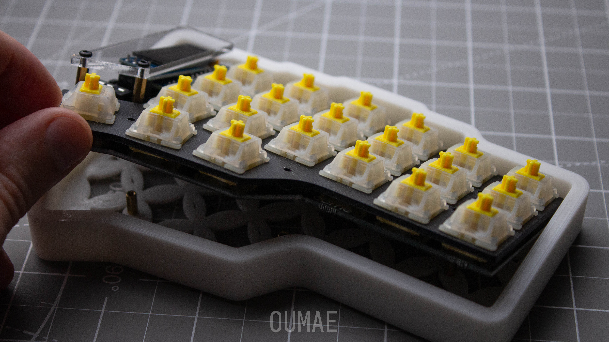

# Сборка базы

1. TOC
{:toc}

## Вам понадобится

1. Свитчи
2. Кейкапы
4. USB-A/USB-C или USB-C/USB-C кабель
3. Отвертка или шестигранник H1.5 *MX/choc, в комплекте с МХ*{: .label}
5. Свитч-форк *только MX, в комплекте с MX*{: .label}
6. Пинцет (возможно)

## Сборка

{: .warning }
> Не вставляйте свитчи в плату, находящуюся в корпусе. Не применяйте грубую
> силу.

1. Если плейты в корпусах, достаньте их. Для этого необходимо выкрутить винты.
    

2. Положите печатную плату на плоскую поверхность, сокетами вниз. Поверх платы расположите плейт.
    

3. Убедитесь, что ноги свитча выпрямлены. При необходимости, выпрямите их с помощью пинцета.
    

4. Если вы собираете МХ клавиатуру, расположите свитч-форк между плейтом и платой и вставьте свитч в место, поддерживаемое им. Если choc, то сразу вставляйте свитч. Повторите с остальными свитчами.
    

5. Уберите свитчи-плейт-плату в корпус. Она должна лежать ровно, без наклона. Закрутите винты на плейте обратно.
    

## Подключение

{: .warning }
> Не соединяйте/разъединяйте половинки включенной клавиатуры.

1. Соедините две половинки с помощью 3.5мм TRRS кабеля. Убедитесь, что коннекторы вставлены до конца.
2. Подключите левую половинку к компьютеру с помощью кабеля, поддерживающего передачу данных.

## FAQ

{: .note-title .question }
> Почему не стоит вставлять свитчи сразу в корпус?
>
> В корпусе печатная плата и хотсвап сокеты не имеют нижней опоры. Если
> при установке свитч не пройдет в сокет, вся сила придется на припаянные
> соединения снизу.
>
> В лучшем случае отойдет сокет, в худшем он утащит с собой оба пада с платы.

{: .note-title .question }
> Что будет если соединить/разъединить половинки включенной клавиатуры?
>
> Скорее всего... ничего. Однако, TRRS коннектор может коротнуть контроллер.

{: .note-title .question }
> Как снять диспеи?
>
> Просто вытащить. Хватайтесь по бокам сокета и тяните вверх.
