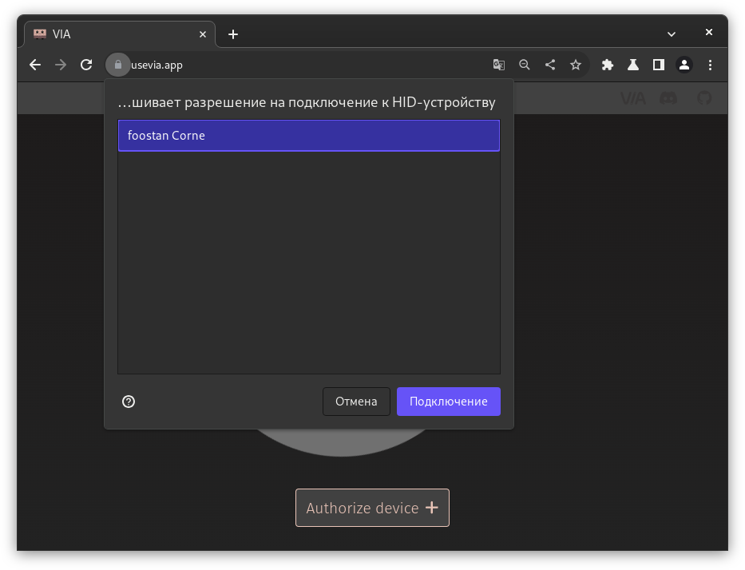
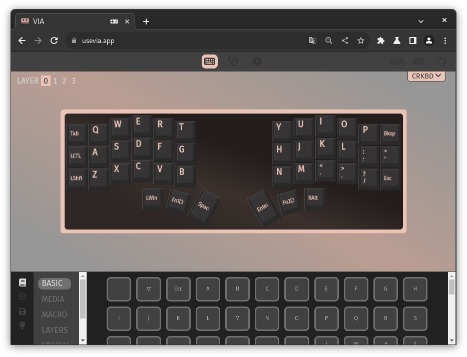
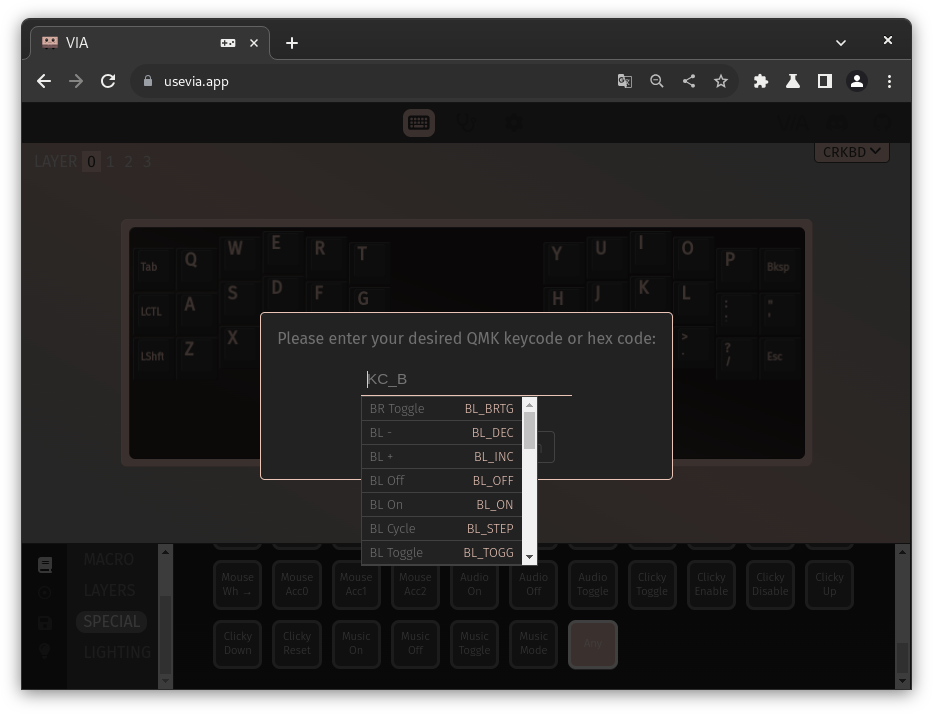

# Настройка

1. TOC
{:toc}

## Via

Если QMK -- прошивка, то Via -- GUI для быстрой настройки клавиш.

1. Запустите браузер на базе Chromium (Google Chrome, Brave, etc).

2. Перейдите по ссылке [usevia.app](https://usevia.app/).

3. Нажмите *Authorise Device*, выберите клавиатуру во всплывающем окне и нажмите *Подключение*.
    

4. Выделите клавишу, которую Вы хотите настроить, а затем выберите ее новое назначение из вкладок внизу окна. Изменения применятся сразу же.
    

## Слои

Слои определяют, что сделает нажатие на данную клавишу. Их можно сравнить с тем, как работают *Shift*{:.k} и *Numlock*{:.k} на обычной клавиатуре. Настроить слой можно выбрав соответствующее число в левом верхнем углу окна Via рядом со словом *Layer*.

По умолчанию, активен слой 0. Основными способами переключения между слоями являются *MO(n)*{:.k} и *TG(n)*{:.k}. Их можно найти во вкладке *Layers*.

- *MO(n)*{:.k} работает как *Shift*{:.k}: слой n активен пока клавиша удерживается.
- *TG(n)*{:.k} активирует слой n. Повторное нажатие на *TG(n)*{:.k} выключает слой n.

## Комбинации клавиш

Популярные сочетания клавиш (например, *Shift*{:.k} + *1*{:.k}), доступны во вкладке *Special*. Они крайне удобны в создании слоя с символами.

*Any*{:.k} из вкладки *Special* позволяет вручную использовать (почти) любой keycode, поддерживаемый QMK. Например, `LCTL(KC_A)` назначит сочетание *Ctrl*{:.k}+*A*{:.k} на выделенную клавишу.

Keycodes в документации QMK: [https://docs.qmk.fm/#/keycodes](https://docs.qmk.fm/#/keycodes).

## FAQ

{: .note-title .question }
> Как активировать слой 3 на Corne в стандартной прошивке?
>
> Нажмите *FN1*{:.k} и *FN2*{:.k} одновременно.
