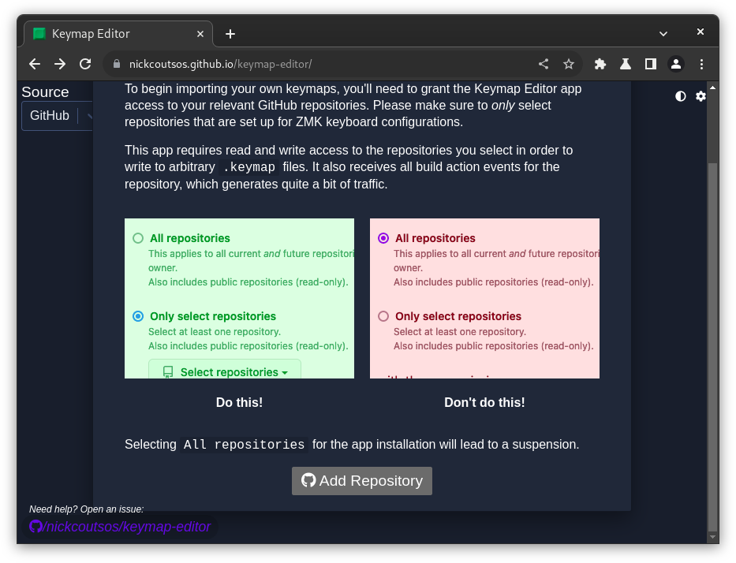

# Подготовка

1. TOC
{:toc}

### Репозитории

- [TOTEM](https://github.com/tsbohc/zmk-config-totem)
- [Corne](https://github.com/tsbohc/zmk-config-corne) (MX/Choc)
- [Lily58pro](https://github.com/tsbohc/zmk-config-lily58) (MX/Choc)

{: .warning}
> Этот раздел содержит процесс, полагающийся на GUI (почти все происходит в браузере, никакой коммандной строки). Если Вы предпочитаете работать с исходниками, то я рекомендую настроить build env по [докам ZMK](https://zmk.dev/docs/development/setup).

## Github Actions

Один из способов работы с ZMK -- через Github Actions. Это позволяет компилировать прошивку на Github, без необходимости установки какого-либо ПО.

1. Создайте аккаунт на [github.com](https://github.com).
2. Форкните мой репо для Вашей клавиатуры. Ссылку можно найти выше.

{: .note-title .question }
> Что такое форк? Как его форкнуть?
>
> Форк - копия репозитория, в которую Вы можете вносить изменения. Она сохранится в Вашем профиле на Github. Сделать форк можно, нажав на соответствующую кнопку справа вверху страницы репозитория.

## Keymap Editor

Браузерный GUI для редактирования раскладки ZMK от [nickcoutsos](https://github.com/nickcoutsos/). Это не аналог Via или Vial -- изменения не применяются сразу. Однако, простора для кастомизации в нем на порядок больше.

1. Перейдите по ссылке [nickcoutsos.github.io/keymap-editor/](https://nickcoutsos.github.io/keymap-editor/)
2. В качестве источника выберите Github. Нажмите "Login with GitHub" и авторизируйтесь.

    

3. Нажмите "Add Repository".

    

4. Выберите репо, которое Вы форкнули ранее. Не выбирайте вариант "Все репозитории".

    

5. И наконец, мы в редакторе с:

    
