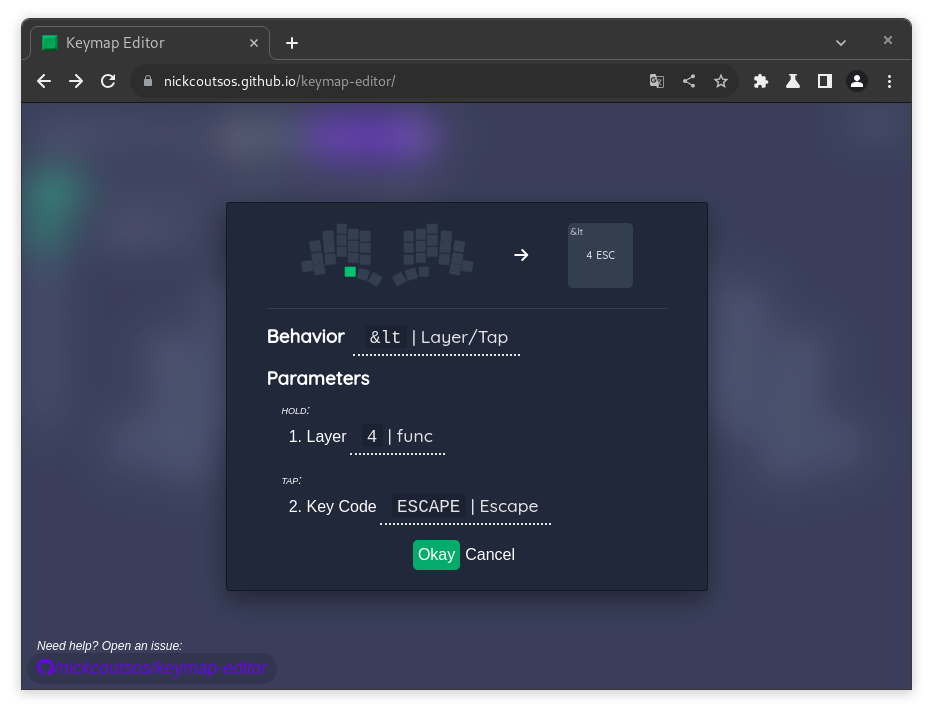
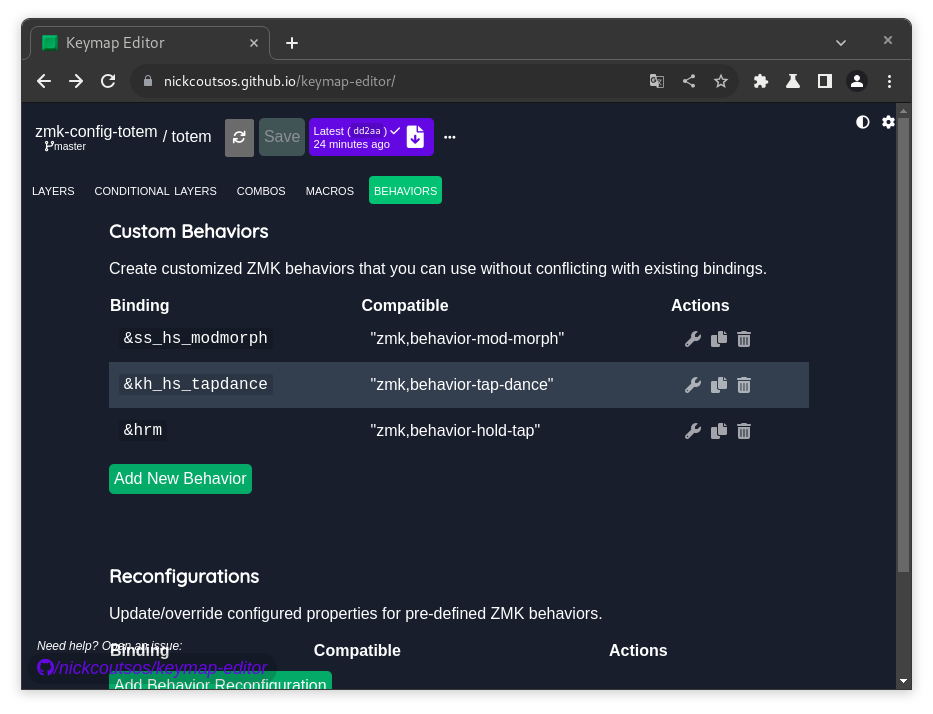

# Настройка

1. TOC
{:toc}

## Раскладка

В левой части окна Keymap Editor Вы найдете вертикальное меню для выбора слоя. Перейдите на нужный слой, а затем выделите клавишу, которую хотите настроить.

#### Мини-словарь

- Layer -- слой
- Behavior -- поведение
- Hold -- зажатие, удерживание нажатия на клавишу
- Tap -- короткое, быстрое нажатие на клавишу

## Поведение

Определяет, что произойдет при нажатии/зажатии клавиши. Основные:

| &? | Пояснение |
| :-------: | ------- |
| *&kp*{:.k} | Обычное нажатие. |
| *&mo*{:.k} | Выбранный слой активен, пока клавиша удерживается. |
| *&mt*{:.k} | Зажатие -- клавиша модификатор, нажатие -- обычное нажатие. |
| *&lt*{:.k} | Зажатие -- активен указанный слой, нажатие -- обычное нажатие. |
| *&bt*{:.k} | Все, что связано с беспроводным соединением. |
| *&out*{:.k} | Переключение между проводным и беспроводным соединением. |
| *&hrm*{:.k} | Мое кастомное поведение на основе *&mt*{:.k} для homerowmods. Так проще редактировать тайминги. |

С подробным списком и описаниями можно ознакомиться в [документации ZMK](https://zmk.dev/docs/behaviors/key-press) (англ).

## Bluetooth

### Профили и &bt

Профили ZMK позволяют привязать клавиатуру к нескольким устройствам, а потом переключаться между ними с помощью `BT_NEXT` и `BT_PREV`.

Один профиль может быть привязан только к одному устройству. Очистить текущий профиль можно с помощью `BT_CLR`, а все -- через `BT_CLR_ALL`.

### &out

Клавиатура также может быть подключена к одному устройству для зарядки, но отправлять нажатия на другое устройство по Bluetooth. Между проводным и беспроводным соединением можно переключаться с помощью `OUT_TOG`.

## Тайминги &hrm

В окне Keymap Editor, перейдите во вкладку "Behaviors" и нажмите на иконку гаечного ключа в строке с *&hrm*{:.k}.

- `require-prior-idle-ms` -- время, которое должно пройти после последнего отпускания любой клавиши, чтобы *&hrm*{:.k} начал регистрировать зажатие. Если прошло меньше, то *&hrm*{:.k} ведет себя как нажатие. Это помогает избежать случайных активаций модификаторов при печати.
- `tapping-term-ms` -- длительность зажатия клавиши, после которой *&hrm*{:.k} переходит в режим зажатия (модификатора).
- `quck-tap-ms` -- TODO.

Все тайминги указываются в милисекундах.
