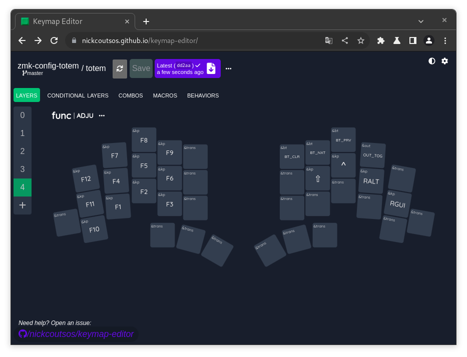
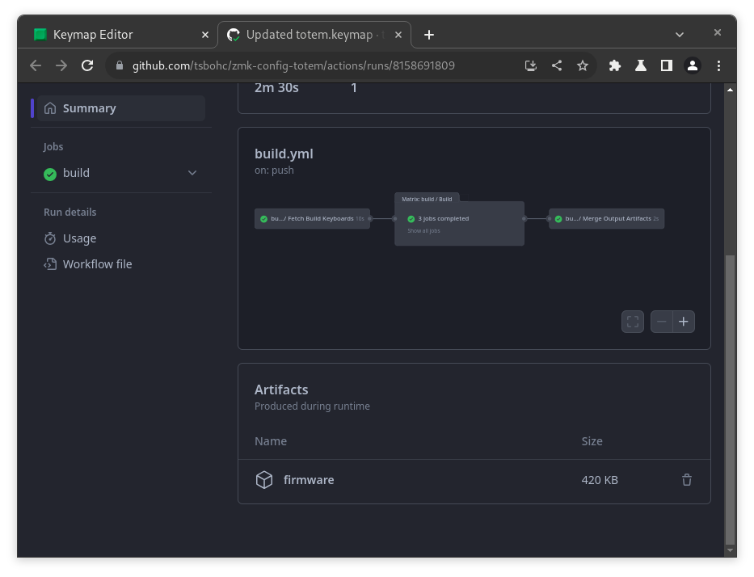

# Перепрошивка

1. TOC
{:toc}

## Компиляция

1. После внесения изменений в раскладку, нажмите "Save" в верхней части окна Keymap Editor. Во всплывающем окне можно оставить комментарий к внесенным изменениям.

2. На синей кнопке сразу справа от "Save" будет виден индикатор загрузки. Компиляция займет пару минут.

    

3. Дождитесь окончания компиляции. Индикатор загрузки заменится на галочку. Нажмите на синюю кнопку.

    

4. В самом низу открывшейся страницы, нажмите на "firmware". Сохраните архив.

    

## Прошивка

1. Распакуйте архив. Внутри Вы найдете файлы для прошивки.
2. Подключите левую половинку к компьютеру с помощью кабеля, поддерживающего передачу данных.
3. Откройте проводник или другую программу для просмотра папок.
4. Дважды быстро нажмите на Reset кнопку на корпусе клавиатуры.
5. Перенесите файл прошивки для левой половинки в определившееся устройство.

Повторите шаги выше с правой половинкой, но уже используя файл для правой.

{: .note-title .question }
> При перемещение файла выдает ошибку.
>
> Ничего страшного. Контроллер перезапускается так быстро, что ОС не успевает проверить перенесся ли файл. Источник: [доки ZMK](https://zmk.dev/docs/troubleshooting#file-transfer-error).
